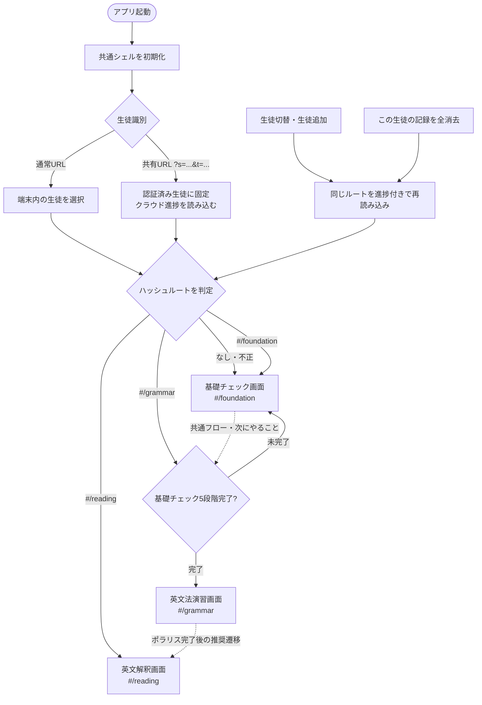
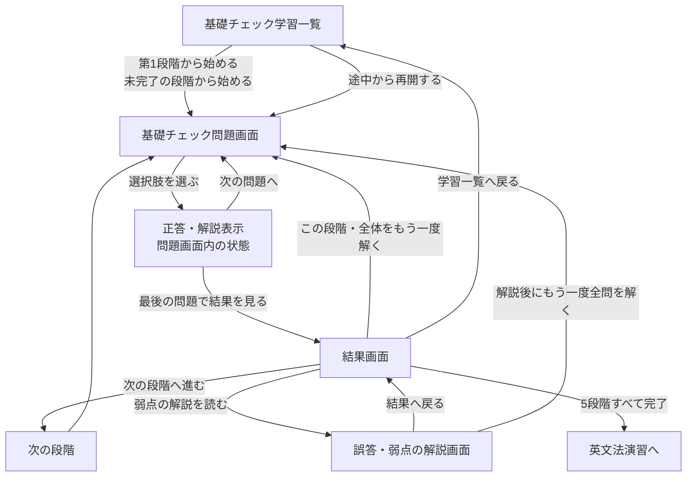
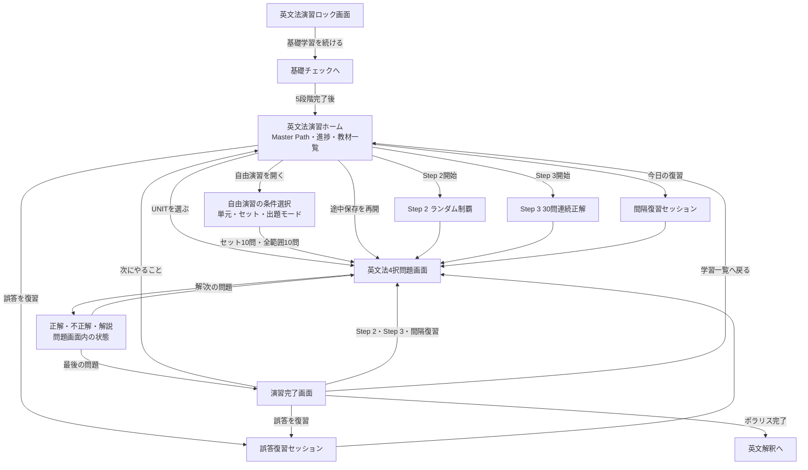
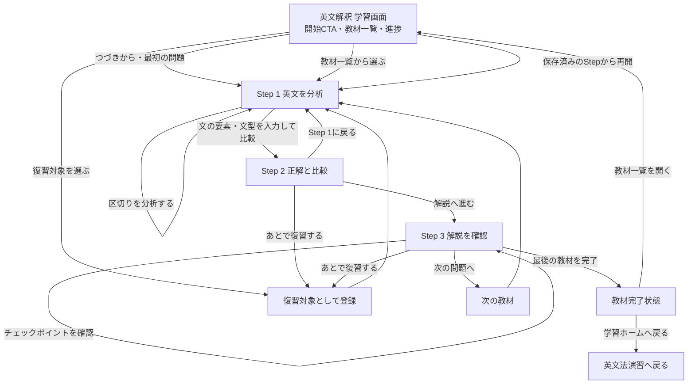
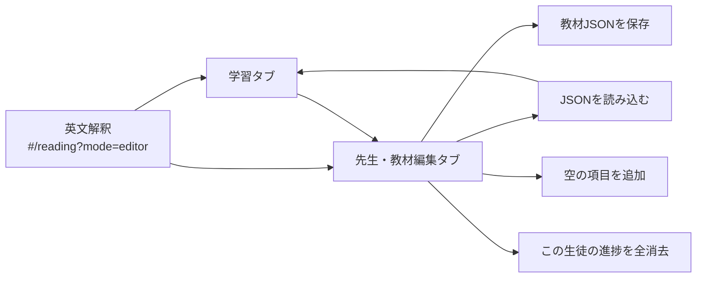

# 英文法トレーナー｜画面遷移図

作成日: 2026-07-29
対象: `C:\Users\shtom\dev\english-grammar-trainer`
基準: 現行実装（`shared/shell.js`、`shared/router.js`、各モジュールの `app.js`）

## 1. 対象範囲

この図は、統合後の単一アプリにおける画面と主要な操作の遷移を示す。

- 入口は `index.html` だけ。
- モジュールの切替はハッシュルートで行う。
  - `#/foundation`：基礎チェック
  - `#/grammar`：英文法演習
  - `#/reading`：英文解釈
- ハッシュがない、または不正な場合は `foundation` を表示する。
- 生徒切替・進捗保存・横断ナビゲーションは共通シェルが管理する。

## 2. 全体画面遷移図

## 3. 共通シェルの画面要素

各ルートの本文の外側には、次の共通要素が表示される。

| 要素 | 遷移・動作 |
|---|---|
| 生徒選択 | ローカルモードで生徒を切り替え、現在のハッシュルートを再読み込みする |
| 生徒追加 | 生徒名を登録し、その生徒を選択した状態で現在のルートを再読み込みする |
| 学習フローナビ | `foundation`、`grammar`、`reading` を切り替える。未解放の英文法演習は押せない |
| 次にやること | `shared/flow.js` が進捗から推奨モジュールを決め、該当ルートへ移動する |
| フッターの記録削除 | 確認後、現在の生徒の3モジュール分の進捗を消去して現在のルートを再読み込みする |
| 共有状態表示 | 共有URL利用時はクラウド保存状態を表示する |

## 4. 基礎チェックの画面遷移

基礎チェックは、5段階を順番に進める4択演習である。

### 基礎チェックの分岐条件

- 問題を選ぶと、その場で正誤・正答・解説を表示する。
- 各段階の最後まで回答すると結果画面へ進む。
- 結果画面では、次の段階、弱点解説、再演習、学習一覧を選べる。
- 5段階すべての `completed` が `true` になると、英文法演習が解放される。
- 途中保存がある場合は、問題番号・選択中の解答・解説確認状態を復元する。

## 5. 英文法演習の画面遷移

英文法演習は、基礎チェック完了前はゲート画面、完了後は3段階の学習ホームになる。

### 英文法演習の解放条件

| 段階 | 内容 | 解放条件 |
|---|---|---|
| ゲート | 基礎チェックへの誘導 | 基礎チェック5段階が未完了 |
| Step 1 | UNIT演習 | 基礎チェック5段階完了で利用可能 |
| Step 2 | 未クリア問題のランダム制覇 | Step 1の全問題を `step1Cleared` |
| Step 3 | 30問連続正解チャレンジ | Step 2の全問題を `step2Cleared` |
| 間隔復習 | 1・3・7・14日後の復習 | Step 2の正解問題に復習予定日が設定される |
| 英文解釈 | 次の推奨学習 | Step 3で `mastered` 達成 |

### 英文法演習のセッション種別

- `step1`：選択したUNITの演習
- `step1Wrong`：Step 1の誤答演習
- `step2`：未クリア問題からのランダム演習
- `step2Single`：ヒートマップから選んだ1問の確認
- `step3`：30問連続正解チャレンジ
- `setAll`：選択したセットの自由演習
- `tenTest`：全範囲からランダム10問
- `review`：未解決の誤答復習
- `spaced`：今日が復習予定日の問題

これらは別画面ではなく、同じ問題画面をセッション種別ごとに使い分ける。

## 6. 英文解釈の画面遷移

英文解釈は、教材を選択して1英文を3ステップで確認する。推奨導線は英文法演習の後だが、ルート自体は先に開ける。

### 英文解釈の内部状態

| 状態 | 主な操作 | 次の状態 |
|---|---|---|
| `first` | スラッシュ分割、文の要素、文型、自分の訳を入力 | 準備完了後に `compare` |
| `compare` | 自分の分析と先生データを比較 | `input` または `first` |
| `input` | 解析・指針・解説・和訳例・語句を確認 | チェック後に次の教材または完了 |
| 復習対象 | 「あとで復習する」で登録 | 学習画面の復習一覧へ戻る |

## 7. 教材編集画面

教材編集は通常の生徒画面には表示されず、`#/reading?mode=editor` でのみ有効になる。

編集画面は教材JSONを扱う管理用の画面であり、生徒向け学習導線には含めない。

## 8. 保存・再開に関する補足

- 生徒ごとの統合進捗は `egt.progress.<生徒ID>` に保存する。
- クラウド同期は共有URLで認証された場合だけ有効になる。
- 生徒を切り替えると、同じルートを新しい生徒の進捗で再描画する。
- 基礎チェックは `inProgress` を復元する。
- 英文法演習は `__session` を復元する。
- 英文解釈は教材ごとの `lastItemId` と `lastStep` を復元する。
- 画面を閉じても、次回の「次にやること」または各モジュールのCTAから再開できる。

## 9. 実装上の根拠

- ルート判定・モジュール切替：[shared/router.js](../shared/router.js)
- 解放条件・推奨順：[shared/flow.js](../shared/flow.js)
- 共通シェル・生徒切替・横断CTA：[shared/shell.js](../shared/shell.js)
- 基礎チェック：[modules/foundation/app.js](../modules/foundation/app.js)
- 英文法演習：[modules/grammar/app.js](../modules/grammar/app.js)、[modules/grammar/view.html](../modules/grammar/view.html)
- 英文解釈：[modules/reading/app.js](../modules/reading/app.js)、[modules/reading/view.html](../modules/reading/view.html)

画面上の表示切替だけで済む状態は、独立画面ではなく「同一画面内の状態」として記載している。たとえば、問題回答後の解説表示、英文解釈の3ステップ、英文法演習のセッション種別が該当する。
