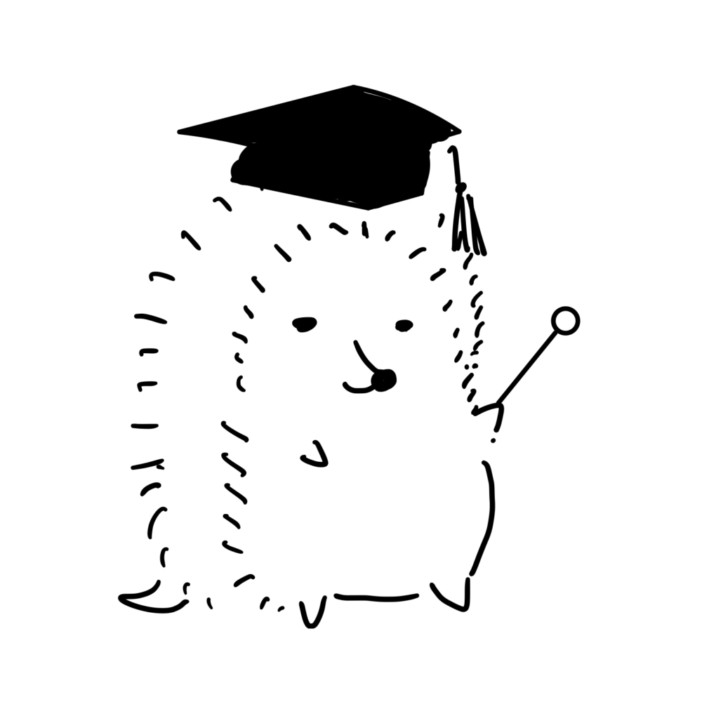

# 名詞節・that／what／whether

名詞節は、節全体が主語・目的語・補語になるまとまりです。まず主節のどの席に入るか、次に節の内部が完全か、接続語自身が役割を持つかを確認します。

## 1. 名詞節と副詞節を分ける

:::board
I know [that he is honest].
I left [because he was tired].
:::

`that he is honest`は`know`の目的語、`because he was tired`は`left`の理由です。節全体が名詞の席に入るか、主節を説明するかを先に分けます。

:::check check-24-conjunctions-noun-01
question: 次の文の空所に入る語は? I don't know ( ) he will come.
choice: A|if
choice: B|because
answer: A
explanation: if he will come は know の目的語となる名詞節で、「彼が来るかどうか」を表します。
:::

## 2. that節は後ろが完全な文

:::board
the news that he passed away
that + S + V + 必要な要素
:::

同格の`that`は、前の名詞の内容を説明します。`the news that he passed away`では、`he passed away`が完全な文です。関係代名詞のthatと違い、that自身が節内の主語・目的語にはなりません。

:::check check-24-conjunctions-noun-02
question: 次の文の空所に入る語は? The news ( ) he passed away is a shock to my family.
choice: A|that
choice: B|which
answer: A
explanation: he passed away は目的語などの欠けがない完全な文なので、the news の内容を説明する同格の that です。which は後ろに主語や目的語が欠けた不完全な文が続く関係代名詞なので、ここでは使えません。
:::

## 3. ifとwhetherは「〜かどうか」

:::board
I don't know if he will come.
I don't know whether he will come.
whether ... or not
:::

「〜かどうか」の名詞節では`if/whether`が使えることがあります。`whether or not`、主語になる形、前置詞の後ろなどでは`whether`を選ぶことがあります。

:::check check-24-conjunctions-noun-03
question: 次の文の空所に入る語は? The problem is ( ) my dad will allow me to study abroad or not.
choice: A|whether
choice: B|if
answer: A
explanation: 後ろに or not が続くとき、be動詞の補語になる名詞節では whether を使います。if は or not を直接伴う形や、補語の位置では避けます。
:::

## 4. whatは節内の役割を持つ

:::board
what he wants
what he said
what = the thing(s) that
:::

`I know what he wants.`では、`what`が`wants`の目的語です。`What he said surprised everyone.`では、what節全体が主語。`that`との違いは、what自身が節内の席を持つことです。

:::check check-24-conjunctions-noun-04
question: 次の文の空所に入る語は? ( ) he said surprised everyone.
choice: B|What
choice: A|That
answer: B
explanation: What he said は「彼が言ったこと」という名詞節で、文の主語です。
:::

## 5. how + 形容詞も名詞節を作る

:::board
how I wash my face
how difficult the results could be
how + 形容詞 + S + V
:::

`how I wash my face`は「どのように洗うか」、`how difficult the results could be`は「どれほど難しいか」です。疑問文の語順にせず、名詞節の内部は平叙文の語順にします。

:::check check-24-conjunctions-noun-05
question: 次の文の空所に入る語は? They did not realize ( ) interesting the results could be.
choice: A|how
choice: B|how much
answer: A
explanation: how + 形容詞 + S + V で「どれほど~か」という名詞節を作ります。how interesting the results could be 全体が realize の目的語です。
:::

## 6. whether節は主語にもなる

:::board
Whether he comes or not depends on us.
Whether or not you will succeed depends ...
:::

`whether ...`全体が主語になることもあります。節全体を一つの名詞のまとまりとして囲み、主節の動詞との関係を見ます。

:::check check-24-conjunctions-noun-06
question: 次の文の空所に入る語は? ( ) you will succeed depends on how hard you work.
choice: B|Whether or not
choice: A|Even if
answer: B
explanation: Whether or not you will succeed 全体が主語で、「成功するかどうか」を表す名詞節です。後ろの depends が主節の動詞です。
:::

## 7. 名詞節を解く手順

:::board
1. 主節の席を決める
2. 後ろが完全か確認
3. 接続語が節内で役割を持つか見る
4. 語順を整える
:::

`that`は完全な節、`what`や疑問詞は節内の役割を持つ、と整理します。選択肢の訳より先に、節の内部を戻して確認します。

:::check check-24-conjunctions-noun-07
question: 次の文の what you need の働きとして最も適切なものを選びなさい。 Tell me what you need.
choice: A|動詞tellの目的語
choice: B|主語Tellの補語
answer: A
explanation: what you need 全体が「あなたが必要とするもの」という名詞節で、Tell の目的語です。
:::

## 教授からの課題

名詞節全体を括弧で囲み、主語・目的語・補語のどこに入るか、接続語が何をしているかを説明して問題を解きます。

:::practice
このセクションの問題を解く
:::
